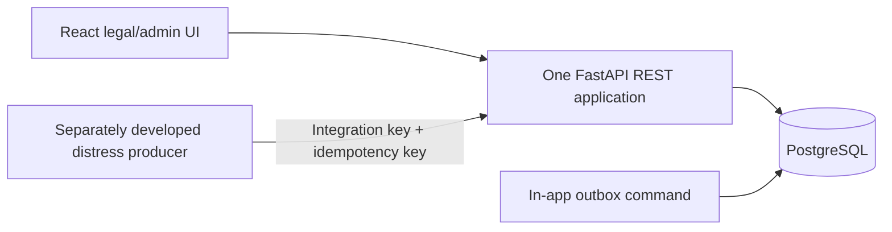
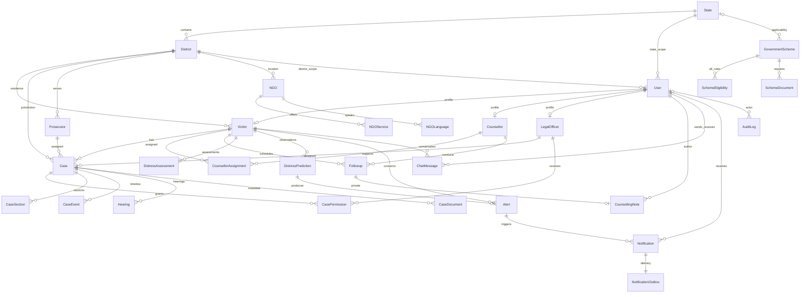

# Architecture and data model

## Existing architecture

Inspected repository: `swastya/` held a React 19 / Vite 8 starter with one demo component, CSS and static assets. No backend, database, application routing or authentication existed. The implementation retains the frontend directory, dependencies and Vite setup, replacing the starter screen and adding feature components.

## Application boundaries

`backend/app/main.py` composes `auth`, `cases`, `support`, `directories` and `analytics` routers. `security.py` centralizes scoped SQL predicates and access checks. `presenters.py` explicitly projects response fields. `notifications.py` is a transaction-aware domain service. NGO ranking and scheme evaluation are pure replaceable functions. SQLAlchemy sessions provide the unit of work; no generic repository wrappers or microservices are introduced.

## Entity relationships

All records use generated UUID strings as primary keys, with `created_at` and `updated_at` in UTC. Human-readable `Case.case_id` is separately unique. Districts reference states; cases, victims and NGOs derive state through their district rather than duplicating it. Join records normalize sections, services, languages, permissions and required documents. JSON is confined to version-independent prediction factors and typed eligibility operands. Foreign keys and uniqueness constraints protect referential integrity. `UTCDateTime` normalizes SQLite test/demo dates to the PostgreSQL UTC response contract.

The checked-in initial Alembic migration is frozen and does not import changing application metadata. Later changes should use new migrations. There is no automatic schema creation on server startup.

## Access policy

| Role | Case/victim records | Support data | Analytics | Writes |
|---|---|---|---|---|
| VICTIM | Own only | Own follow-up metadata and distress history | None | None in this scope |
| COUNSELLOR | Actively assigned victims | Assigned follow-ups/distress; own authored notes only | None | Own assigned follow-ups; alert acknowledgement |
| LEGAL_OFFICER | Assigned cases or explicit case permissions; minimal linked victim profile | No counselling notes, other participants’ chats, follow-ups or distress factors | Legal overview only | Assigned/edit-permitted cases |
| DISTRICT_ADMIN | Cases/victims within district | Follow-up metadata, operational alerts; no notes or detailed distress | Own district | Alert acknowledgement |
| STATE_ADMIN | Cases/victims within state | Follow-up metadata, operational alerts; no notes or detailed distress | Own state, narrower district | Alert acknowledgement |
| NATIONAL_ADMIN | No victim/case row access | No individual support records | National, narrower state/district aggregates | None |

Directories contain non-clinical information and are available to authenticated roles across jurisdictions. Victim-specific matching/eligibility still requires victim access. No general endpoint lists raw counselling notes, assessments, password hashes or object-storage keys. Chat reads are restricted to their two current participants and victim context. Notes are a separate table and only their author, while still assigned, may retrieve them. There is no automatic consent-sharing pathway to legal officers.

Authorization uses the current database user role on every request, not client-supplied role claims. Assignment removal and account deactivation therefore take effect immediately. Resource reads combine ID and access scope in SQL; missing and forbidden IDs return the same 404. Role-wide denials return 403. Integration ingestion uses a separate constant-time checked credential and cannot log in as a user.

Successful sensitive reads/writes and authentication events generate audit records without request bodies or clinical content. Denials are recorded in a separate transaction so rollback does not erase them. Failed authentication does not record submitted credentials. Application roles cannot edit or read audit logs. Database operators must restrict direct modification and configure retention/archival separately.

## Case and analytics semantics

- Timeline events carry `event_type`, free-form `stage`, description, timestamp and actor. The latest occurred event defines stage; there is no fixed workflow chain. Events are append-only through the API and cannot be future-dated.
- `next_hearing` is the earliest future scheduled hearing, derived rather than duplicated.
- A delayed case is an open case with no timeline event in the last 30 days (creation time is the fallback). This is an operational demo threshold, not a statutory deadline.
- Hearings this week means Monday 00:00 UTC through the next Monday, excluding cancelled hearings.
- High-risk cases count cases whose victim's latest observation is HIGH or CRITICAL, not all historical predictions. Distress trends are mean scores over observations per calendar month. A victim with several observations contributes several observations, which is reported alongside the mean.
- Pending follow-ups include future and overdue PENDING items. Critical alerts count unacknowledged CRITICAL alerts.
- Average case age includes open and closed cases and measures days since registration. Status/category breakdowns use the same case jurisdiction filter.
- National filters can narrow aggregates, but never enable victim-level drill-down.

## Implementation sequence

Models and migration → authentication/scopes → case/support contracts → directories/rules → analytics/outbox → synthetic seed → React dashboards → authorization/workflow tests and builds. The architecture plan was presented before code changes.

## Law-enforcement module

The `LAW_ENFORCEMENT` role uses the existing authentication and profile system. Its operational data is limited to assigned same-district complaints, linked FIR registration records and complaint-specific messages. Victims file and read only their own complaints; district/state administrators see assignment metadata and can transfer assignments within jurisdiction. National administrators have no individual complaint access. Complaint threads, pairwise support-team conversations and counselling notes have separate access rules.

The four new tables and API/security contracts are documented in [law-enforcement.md](law-enforcement.md). The same React complaint workspace is used by victims and law-enforcement officers, with role-appropriate actions enforced again by FastAPI.

## Support-team communication

The communications module reuses ChatMessage for victim/staff and cross-department one-to-one threads. Membership comes from current counsellor assignments, assigned/permitted cases and jurisdiction-valid complaint assignments. The same React SupportTeam component serves the three staff dashboards and victim dashboard. See [support-team.md](support-team.md) for contracts and confidentiality rules.
