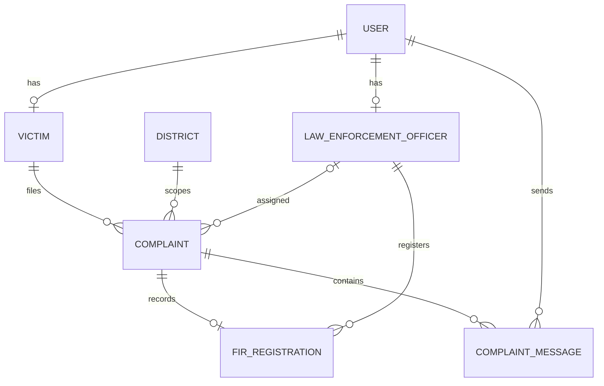

# Law enforcement and complaint workflow

This module runs inside the existing FastAPI application. It uses the existing PostgreSQL database, JWT authentication, audit log and in-app notification infrastructure. No extra services or dependencies are required.

## Activate the update

From PowerShell in the project folder:

```powershell
cd C:\Users\Keith\SIHH\badabee\backend
.\.venv\Scripts\python.exe -m alembic upgrade head
.\.venv\Scripts\python.exe create_staff.py
```

Choose **3. Law Enforcement Officer**, enter their name/email/password, select their district and enter the police station. Staff accounts are provisioned by the installation administrator; public signup remains victim-only. Do not reset or reseed an existing database.

Restart the app using **Stop Badabee.vbs**, then **Start Badabee.vbs**. Sign in with the new officer's email and password. Their sidebar contains **Complaints & FIRs**, with the same homepage and My Profile as other roles.

## Use it

1. A victim opens **Complaints & FIRs → File a complaint** and enters a subject, description, incident location and optional incident date.
2. The server derives their identity and district from the authenticated victim profile. It assigns an active officer in that district with the fewest open complaints. Ties are deterministic. Simultaneous submissions may give approximately balanced rather than perfectly balanced loads.
3. Without an available officer, the complaint remains submitted with **Awaiting assignment**. A district/state administrator opens **Complaint assignments**, selects a same-district officer, and saves. The same view supports transfers. It contains assignment metadata, not the complaint narrative or conversation.
4. The assigned officer reviews the complaint, records an issued FIR number/station/date, and replies in its message thread. The victim sees that FIR and conversation in their own dashboard. The FIR does not create or edit a legal case automatically.
5. The conversation refreshes every 15 seconds while its browser tab is visible. Messages are persisted. Older/newer controls paginate the history. Closing a complaint makes the conversation read-only; FIR records remain visible.

This records FIR details within SWASTYA. It does not register an FIR in an external police/government system and is not an emergency-response integration. There are no email/SMS messages; notifications are persisted for the existing `/notifications` API.

## Access rules

- Victim: own complaints, FIR records and conversation only.
- Law enforcement: currently assigned complaints in their district only. No counselling notes, distress records, legal cases, directories or analytics.
- District/state admin: assignment metadata and assignment changes within jurisdiction only; no complaint detail or messages.
- National admin, legal officer, counsellor: no access to complaint narratives or complaint conversations. Assigned staff can use separate pairwise support-team chats; see [support-team.md](support-team.md).
- Reassignment immediately revokes the previous officer's access, including old messages. The new officer can read the complaint's history.
- Reads, mutations and denied requests are audited. Bodies and passwords are not copied into audit entries.

## Model



Migration `86d8e04f1741` adds four tables and widens `users.role`. Existing accounts and records are preserved. The unique FIR key is district + normalized station + registration year + normalized FIR number, and each complaint has at most one FIR. Each new table has created/updated UTC timestamps.

## REST contract

All endpoints require a bearer JWT. Unknown input fields are rejected. Out-of-scope IDs return 404; forbidden roles 403; validation 422; duplicate FIR/status conflicts 409.

| Endpoint | Request / response |
| --- | --- |
| POST `/complaints` | Victim: `{subject,description,location,incident_date?}` → complaint, 201. No victim/officer IDs accepted. |
| GET `/complaints` | Own/assigned list, `offset=0&limit=50` (max 100), newest first. |
| GET `/complaints/{id}` | Authorized complaint, including optional FIR and assigned officer name. |
| POST `/complaints/{id}/fir` | Assigned officer: `{number,police_station,registered_on}` → updated complaint, 201. Dates cannot be future or precede a known incident date. |
| PATCH `/complaints/{id}/status` | Assigned officer: `{status:"IN_REVIEW"}` from SUBMITTED, or `{status:"CLOSED"}` from any open status. No reopening. |
| GET `/complaints/{id}/messages` | `{id,body,sender_name,mine,created_at}[]`, newest first; `offset=0&limit=100` (max 200). |
| POST `/complaints/{id}/messages` | Victim/assigned officer: `{body}` (1–4000 characters) → saved message, 201. Requires an active assigned officer and open complaint. |
| GET `/complaints/assignment-queue` | District/state admin: open complaint metadata, oldest first, `offset=0&limit=50` (max 100). |
| GET `/complaints/officers` | District/state admin: active officer options within jurisdiction. |
| POST `/complaints/{id}/assign` | District/state admin: `{officer_id}`; must be active and same district. |

Complaint output: `id,subject,description,location,incident_date,status,created_at,updated_at,district_id,district,victim_name,officer_id,officer_name,police_station,fir`.
FIR output: `id,number,police_station,registered_on`. Statuses: SUBMITTED, IN_REVIEW, FIR_REGISTERED, CLOSED.

## Demo and verification

Only the explicit synthetic seed creates `police1@demo.invalid` through `police9@demo.invalid`, with the password supplied to the seed command. It also creates synthetic complaint/message/FIR examples. Never run the seed against a populated database.

Backend tests cover ownership, assignment/jurisdiction, revocation, private-message restrictions, FIR persistence and validation. Browser verification uses the disposable test database on ports 5174/8001, not real victim records.

## Footer contact details

Create `swastya/.env.local` with real public contact details:

```dotenv
VITE_CONTACT_EMAIL=
VITE_CONTACT_PHONE=
```

Restart Vite (or rebuild a deployment) after filling these in. Empty values display **Not configured**. These are public build-time values; never put secrets here. Email opens the user's email app and phone opens a dialler. The same details appear on the Contact page and shared footer.

## Visual system

The existing DM Sans body / Manrope heading families are retained as the closest match to the supplied raster references. Standard desktop section headings are 38px, body text 15–16px, sidebar links 12px, and desktop header/nav heights approximately 80/42px (public header 96px). Font sizes scale with accessibility settings. Device theme, light/dark, high contrast and reduced motion remain supported. At narrower widths the grids stack and the sidebar becomes wrapping navigation.


## Victim feedback

The footer Contact navigation link has been removed. Only signed-in victim dashboards show its replacement, **Feedback**, at `#/feedback`. Other roles and the public homepage have no replacement link. The existing email/phone contact-details section is separate and unchanged.

Feedback opens the user's mail app with a subject and message addressed to `sreehari.m@btech.christuniversity.in`. The user reviews and sends the draft; SWASTYA does not send email through a backend service or store the message. Operators can override the recipient with `VITE_FEEDBACK_EMAIL` and restart/rebuild Vite. Other roles and unauthenticated visitors cannot open the feedback form.


Law enforcement also has a **Clients** section for basic cards of victims linked through assigned same-district complaints, with authorized staff contacts and pairwise chat. This does not grant clinical or legal case access.
